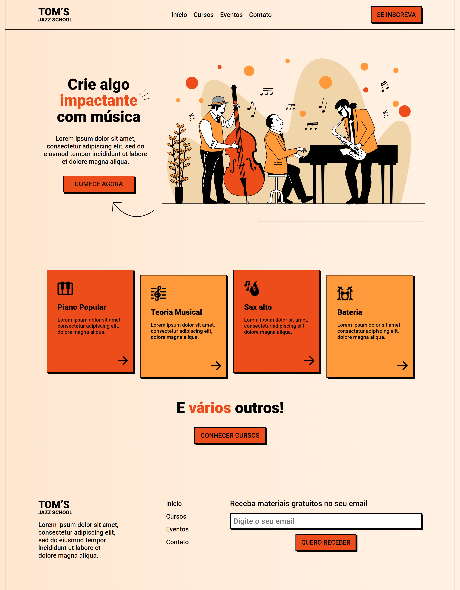

<h1 align="center"> TOM'S Jazz School </h1>

Projeto de uma Landing Page de Escola de Música desenvolvido através do mini curso da OneBitCode.  

  

  

 <h2 align="center"><a href="https://isadoraguiar.github.io/toms-jazz-school" target="_blank">Projeto ao vivo</a></h2>

### 🚀 Tecnologias

Esse projeto foi desenvolvido com as seguintes tecnologias:

- HTML
- CSS
- Figma
- Git e Github

## 🔖 Layout

Você pode visualizar o layout do projeto através [DESSE LINK](https://www.figma.com/file/76GJ4uK7PyKeAo6dcpVyjA/Tom's-Jazz-School?node-id=0%3A1). É necessário ter conta no [Figma](https://figma.com) para acessá-lo.

### :memo: Licença

Esse projeto está sob a licença MIT.

---

Feito com ♥ por Isadora Aguiar :wave:
